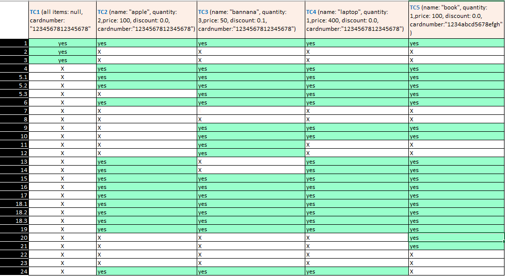

# Марија Бајрамческа Карапанџова 236021

# Control Flow Graph

# Цикломатска комплексност
Цикломатска комплексност е 9. 
Резултатот го добив преку формулата P+1, каде што P е бројот на предикатни јазли. Во случајoв P=8, па цикломатската комплексност изнесува 9.

# Тест случаи според EveryStatement критериумот

На следната табела се прикажани сите тест случаи кои се потребни за да се задоволи EveryStatement критериумот.
За овој код потребни се минимално 5 тест случаеви за да се покријат сите возможни излези од програмата.

# Тест случаи според MultipleConditions критериумот

На следната табела се прикажани сите тест случаи кои се потребни за да се задоволи MultipleStatement критериумот.
За овој код потребни се минимално 4 тест случаеви за да се покријат сите возможни излези од програмата.

# Објаснување на напишаните unit tests

Според EveryStatement

1. SILab2.checkCart(null, "1234567812345678");
allItems е null.
Се активира првиот if (allItems == null) и се фрла RuntimeException.
Се користи за покривање на почетната валидација на листата. 

2. Item item = new Item("apple", 2, 100, 0.0);
   SILab2.checkCart(List.of(item), "1234567812345678");
name е валидно име , price = 100, quantity = 2, discount = 0.0.
Условот за одземање 30 не се активира бидејќи сите се под границата.
discount = 0, па ќе оди во else и изврши price * quantity. Ова важи и за бројот на картичка.
Се користи за извршување на основната логика без попуст или одбивање и да се извршат else гранките.

3. Item item = new Item("banana", 3, 50, 0.1);
discount > 0  па ќе се активира if (discount > 0) и ќе се искористи формулата price * (1 - discount) * quantity.
price = 50, така што нема да се  активира условот за одбивање 30.
Се користи за да се изврши гранката каде што има попуст.

4. Item item = new Item("laptop", 1, 400, 0.0);
price > 300, така што ќе се активира условот кој што ќе одземе 30.
discount = 0 , па ќе оди во else.
Се користи за извршување на условот за одбивање 30 поени.

5. Item item = new Item("book", 1, 100, 0.0);
   SILab2.checkCart(List.of(item), "1234abcd5678efgh");
Сите вредности на item се валидни, но бројот на картичка содржи невалидни карактери односни букви.
Ќе се активира се условот if (allowed.indexOf(c) == -1) и ќе фрла RuntimeException.
Се користи за покривање на валидацијата на број на картичка со невалидни знаци.

Според MultipleStatement

1. Item item = new Item("item1", 1, 350, 0.0);
price > 300 e true, discount = 0, quantity = 1
Ќе влезе во условот поради првата компонента.
Се користи за да се покрие случајот каде само price > 300 е true.

2. Item item = new Item("item2", 1, 100, 0.1);
discount > 0 е true, додека другите се false.
Влегува во условот поради втората компонента.
Се користи за покривање на случајот каде само discount > 0 е true.

3. Item item = new Item("item3", 15, 100, 0.0);
quantity > 10 е true, додека останатите се false.
Се користи за покривање на случајот каде само quantity > 10 е true.

4. Item item = new Item("item4", 1, 100, 0.0);
Сите подуслови се false, така што условот не се исполнува.
Се користи за покривање на единствениот случај кога условот е false.
