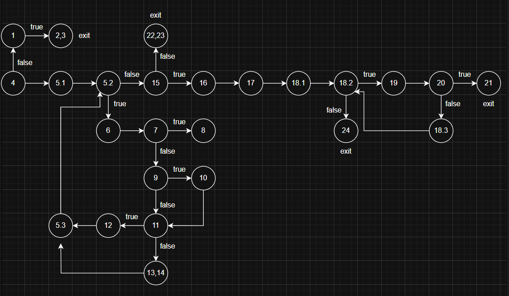
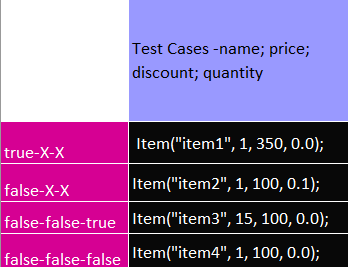

# Марија Бајрамческа Карапанџова 236021

# Control Flow Graph

# Цикломатска комплексност
Цикломатска комплексност е 9. Резултатот е добиен од збирот на предикатните јазли +1.

# Тест случаи според EveryStatement критериумот

# Тест случаи според MultipleConditions критериумот

